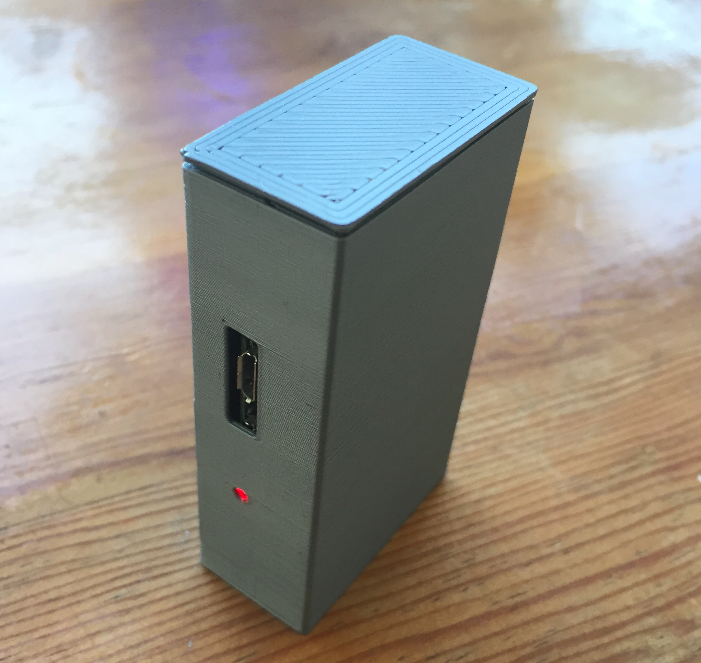
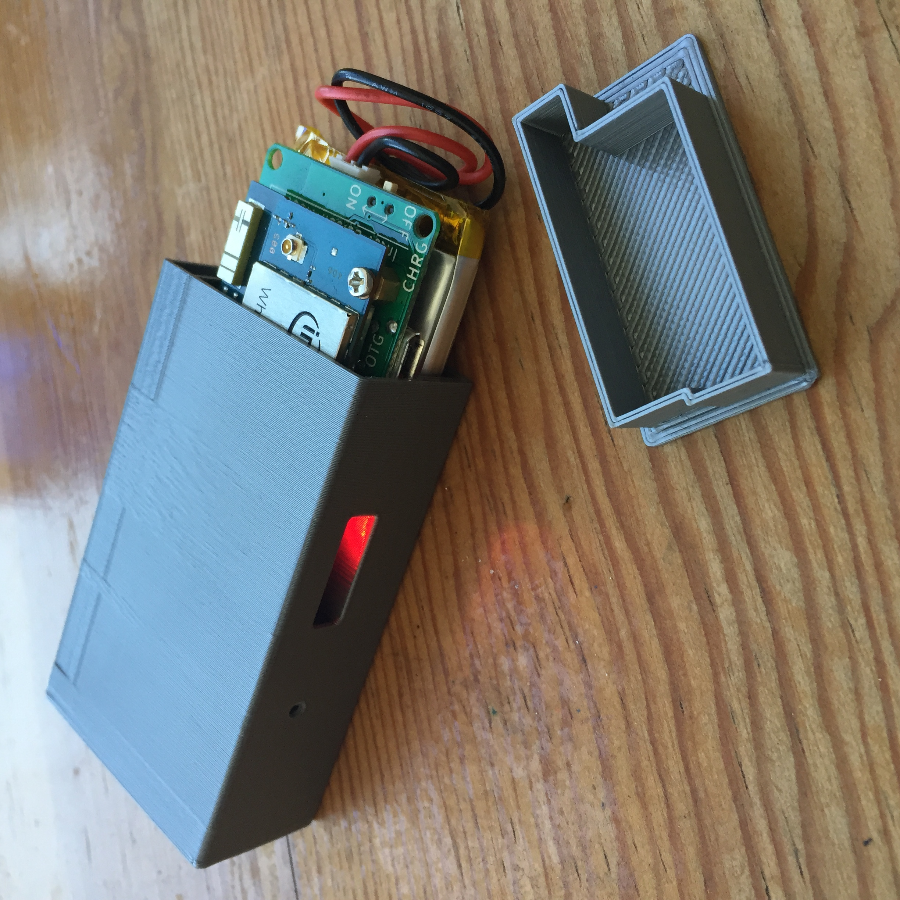
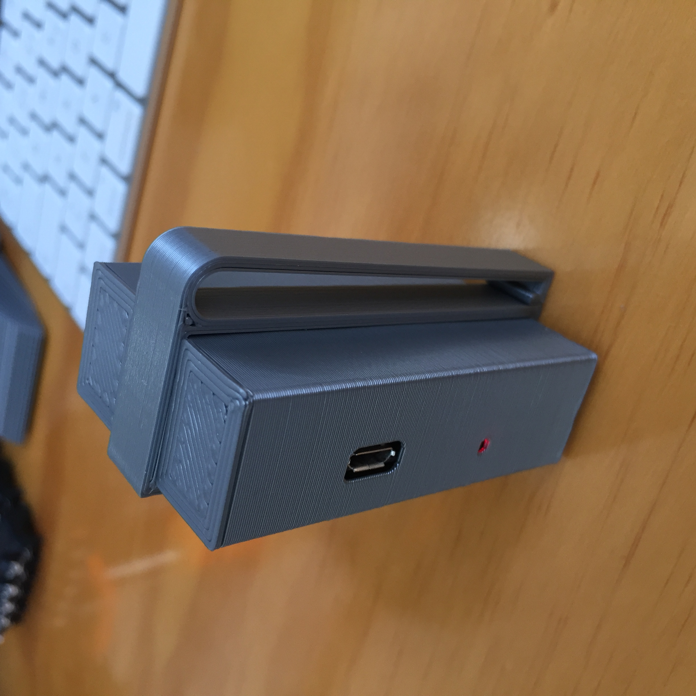

# Explorer Board Case for Intel Edison ( Alternative Version )

The Explorer Board Repository can be found here:

https://github.com/EnhancedRadioDevices/915MHzEdisonExplorer

Here are a couple of pictures of the finished 3D printed case:

The case has two compartments. One for the Explorer Board + Edison & one for the 2000mAh battery. 

They should be arranged as shown on the picture so the battery connector does not get stuck in the case.

There is a variation on the case... a belt clip.

Will probably make it softer / rounder later...